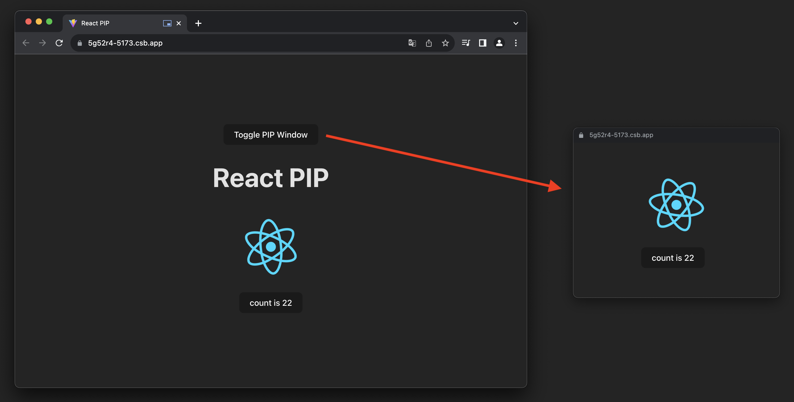
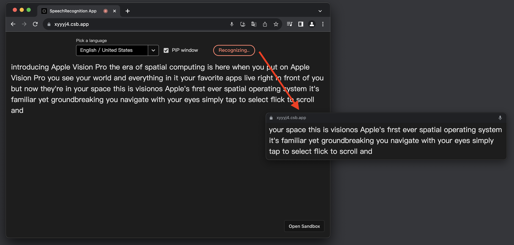

# react-pip (Picture in Picture)

Use [Document Picture-in-Picture](https://developer.mozilla.org/en-US/docs/Web/API/DocumentPictureInPicture/requestWindow) API to create an always-on-top window.

Demos:

- Example: https://5g52r4-5173.csb.app/
  
- Live Caption Overlay: https://xyyyj4.csb.app/
  

## Usage

```tsx
import {PIPPortal} from 'react-pip'

function Demo() {
  const [isOpen, setIsOpen] = useState(false)

  return (
    <>
      <button onClick={() => setIsOpen(!isOpen)}>Toggle PIP Window</button>
      {isOpen && (
        <PIPPortal width={400} height={200} onClose={() => setIsOpen(false)}>
          Content
        </PIPPortal>
      )}
    </>
  )
}
```

## Types

```ts
export type PIPPortalProps = {
  width?: number
  height?: number
  children: React.ReactNode
  onClose?: () => void
}
```

---

## Development

### React + TypeScript + Vite

This template provides a minimal setup to get React working in Vite with HMR and some ESLint rules.

Currently, two official plugins are available:

- [@vitejs/plugin-react](https://github.com/vitejs/vite-plugin-react/blob/main/packages/plugin-react/README.md) uses [Babel](https://babeljs.io/) for Fast Refresh
- [@vitejs/plugin-react-swc](https://github.com/vitejs/vite-plugin-react-swc) uses [SWC](https://swc.rs/) for Fast Refresh
